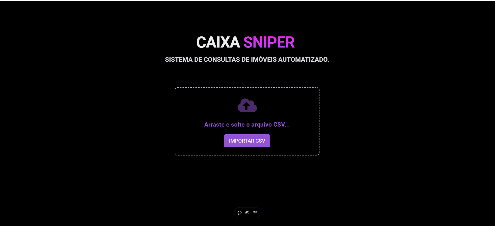
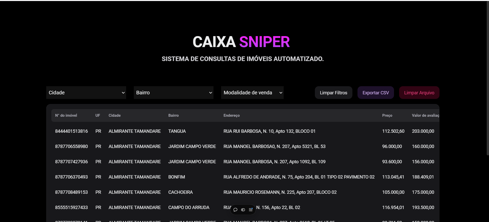
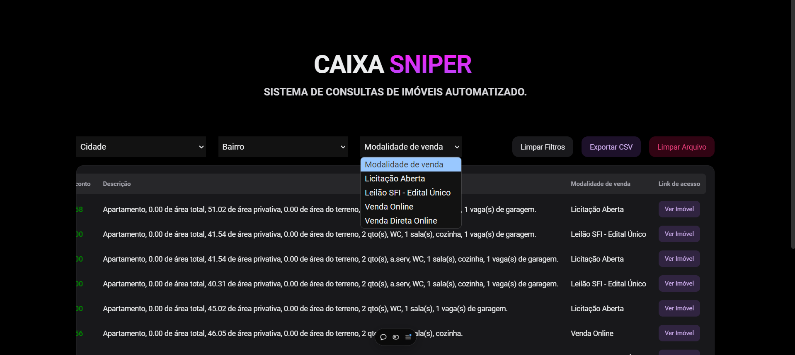

# Caixa Sniper: Sistema de Busca de Imóveis da Caixa Econômica



**Descrição**:  
Caixa Sniper é uma ferramenta web que facilita a pesquisa de imóveis disponíveis para venda na Caixa Econômica Federal. A partir de arquivos CSV fornecidos pela Caixa, o sistema filtra, organiza e exibe imóveis de forma acessível e intuitiva, permitindo ao usuário aplicar filtros avançados e visualizar dados relevantes, como preço, localização e avaliação.

## Funcionalidades Principais

- **Importação Simples de CSV**: Carregue facilmente o arquivo CSV com os dados dos imóveis da Caixa.
- **Filtros Inteligentes**: Encontre imóveis específicos com filtros de localização, faixa de preço, desconto e tipo de venda.
- **Interface Amigável**: Visualize as informações de forma clara, com layout limpo e organizado.
- **Links Diretos**: Acesse diretamente a página de detalhes do imóvel no site da Caixa Econômica.

## Melhorias Futuras

1. **Modularização dos Componentes e Divisão de Responsabilidades**  
   Estruturar melhor o código, modularizando componentes para simplificar o desenvolvimento e facilitar a manutenção.

2. **Histórico de Arquivos Visualizados**  
   Adicionar a possibilidade de manter um histórico de arquivos CSV processados, permitindo ao usuário revisar informações anteriores.

3. **Filtros Inteligentes com Select2**  
   Integrar o Select2 para melhorar a usabilidade dos filtros, tornando a seleção de dados mais dinâmica e intuitiva.

4. **Sugestões da Comunidade**  
   Ideias e melhorias são sempre bem-vindas para expandir ainda mais o Caixa Sniper!

## Como Rodar o Projeto

1. Clone o repositório:
   ```bash
   git clone https://github.com/seuusuario/caixa-sniper.git
   ```

   2. Instale as dependências:
```bash
npm install
   ```
Inicie o servidor de desenvolvimento:
```bash
npm run dev
   ```
Acesse o projeto em http://localhost:3000.

## Instruções para Processar o Arquivo CSV

O **arquivo CSV** é baixado diretamente do site da **Caixa Econômica Federal**. **Antes de enviar o arquivo para o sistema**, é necessário realizar as seguintes etapas de limpeza no **início do arquivo**:

### Passo 1: Baixar o arquivo CSV
- Acesse o site oficial da **Caixa Econômica Federal** para baixar o arquivo CSV com os dados dos imóveis:  
  [https://venda-imoveis.caixa.gov.br/sistema/download-lista.asp](https://venda-imoveis.caixa.gov.br/sistema/download-lista.asp)

### Passo 2: Abrir o arquivo CSV
- Abra o arquivo CSV utilizando um editor de planilhas, como Excel ou Google Sheets, ou um editor de texto para manipulação de dados.

### Passo 3: Limpar o início do arquivo
- **Remova** todas as linhas antes do cabeçalho, que incluem informações adicionais como a **data de geração** ou qualquer outra linha irrelevante.
- **Mantenha** apenas o cabeçalho com os campos: 
  - N° do imóvel, UF, Cidade, Bairro, Endereço, Preço, Valor de avaliação, Desconto, Descrição, Modalidade de venda, Link de acesso.

### Passo 4: Validar o cabeçalho
- Certifique-se de que o arquivo contenha o cabeçalho correto e que ele esteja na primeira linha, pronto para ser processado pelo sistema.

### Passo 5: Salvar o arquivo limpo
- Após a limpeza, **salve** o arquivo com um novo nome ou substitua o antigo para garantir que o arquivo agora contém apenas o **cabeçalho** e as **linhas de imóveis**.

### Exemplo de CSV Antes e Depois

#### Antes da limpeza (exemplo):


#### Depois da limpeza (exemplo):


## Como Contribuir
Faça um fork deste repositório.
- Crie uma nova branch para sua melhoria:
```bash
git checkout -b minha-melhoria
   ```
Faça as alterações desejadas e realize o commit:
```bash
git commit -m "Descrição da melhoria"
   ```
Envie as alterações para o seu fork:
```bash
git push origin minha-melhoria
   ```
Abra um Pull Request para revisão.

## Contato
Se você tiver dúvidas, sugestões ou desejar colaborar de outras formas, entre em contato por e-mail ou **contribua com doações via Pix**.

- E-mail: luigimatheus@hotmail.com
- Pix: luigimatheus@hotmail.com


## Capturas de Tela
Espaço reservado para capturas de tela e exemplos do projeto.




